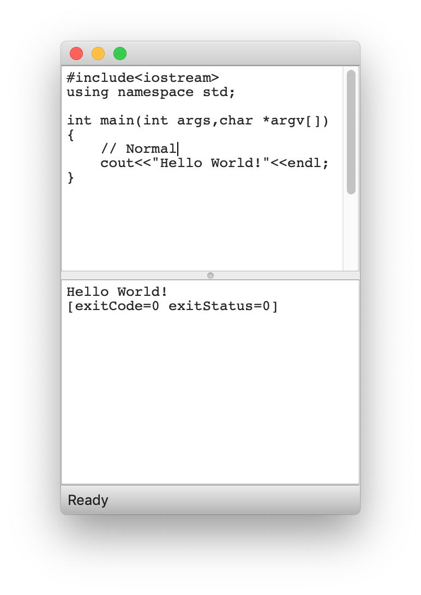
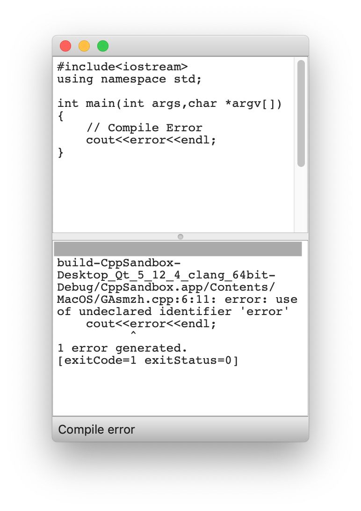
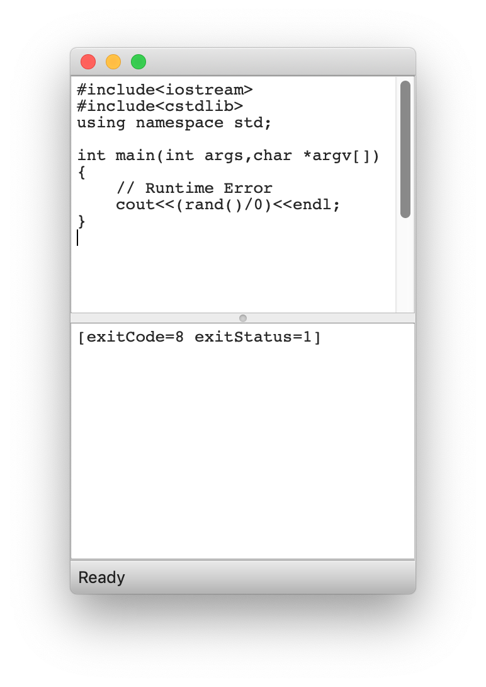

# CppSandbox
A handy quick program to test C++ code.

## How to use it
1. Fire up the program
1. Type in or paste the code. The code must have a ```main``` function.
1. Dependent on the system, press quick-key for ```Save``` action.
1. It will compile and run the code automatically.

## Screenshots

### Normal


### Compile Error


### Runtime Error

